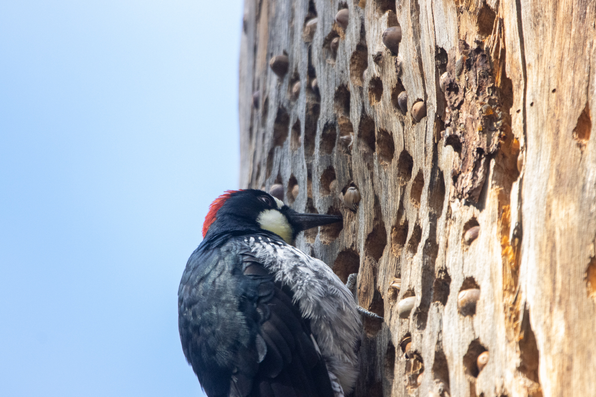

# Chocolate Chip Cookies
%%CAmerican %%CDesserts

%%Q Makes 12 cookies
## Ingredients
- %1% stick of butter, softened
- %100% g white sugar
- %100% g packed brown sugar
- %1% egg
- %5% mL vanilla extract
- %2.5% mL baking soda
- %5% mL hot water
- %1.2% mL salt
- %180% g all-purpose flour
- %170% g semisweet chocolate chips
## Equipment
- Scale
- Hand mixer
- Large mixing bowl
- Small bowl for dissolving baking soda in water
- Paddle
- Something to scrape dough off the paddle
- Two large baking trays
- Parchment paper
- Refrigerator 
## Directions
1. Preheat the oven to 350 °F
2. Mix the white sugar with the brown sugar with the hand mixer. The mixture should be uniform.
3. Add the egg and vanilla extract. Mix with the hand mixer until uniform.
4. Dissolve the baking soda and salt in the hot water then mix it into the egg and sugar mix.
5. Add the flour and chocolate chips and use the paddle to stir until the mixture is uniform
6. Use the paddle to place batter into euqal parts on the baking trays. The dough should be spaced about 2 inches apart to prevent the cookies from combining.
7. Bake in the oven for 11 minutes or until the edges are lightly browned.
